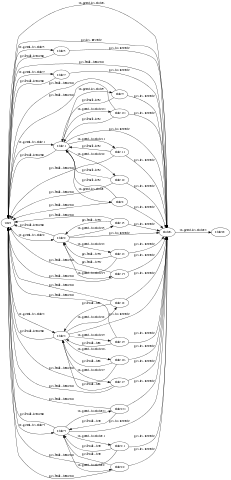

TOC Project 2017
==========================
Implement Code for TOC Project 2017

A telegram bot based on a finite state machine

Setup
-------
### Prerequisite
* Python 3
### Install Dependency
`pip install -r requirements.txt`
* pygraphviz (For visualizing Finite State Machine)
   * Setup pygraphviz on Ubuntu
### Secret Data
`API_TOKEN` and `WEBHOOK_URL` in test.py `MUST` be set to prodper values. Otherwise, you might not be able to run your code.

### Run Locally
  You can either setup https server or using ngrok as a proxy.

  ##### grok would be used in the following instruction

  `ngrok http 5000`
  
  After that, ngrok would generate a https URL.

  You should set `WEBHOOK_URL` (in test.py) to your-https-URL/hook.
 
### Run the sever
`python3.4 test.py`

Finite State Machine
---------------------

Usage
------------
This is a bot for search hotels in Taiwan.And also have a note that user can edit him/herself.
The initial state is `user`. When you entering the bot(means you type `/start`)
it will reply the initial message.
In each state, we can type `/menu` to go back to menu,and type `/我的最愛` to watch what
we have added in favorite list.
* user
  * input  "/北部" or "/中部" or "/南部" or "/東部" or "/外島"
    * goto state 1 ,2 ,3 ,4 ,5
    * it will ask you to print county in this area
  * input  "/我的最愛"  
    * it can watch what we have added in favorite list.
  * input "/each county"
    * it will show you the hotela in this country and its website
    * in this state you can type `/add + data you what to add` ,and the data will be save into a favorite list
  * input "/推薦" 
    * it will random generate a photo of travel to show you
    

Reference
------------
Lee-W
